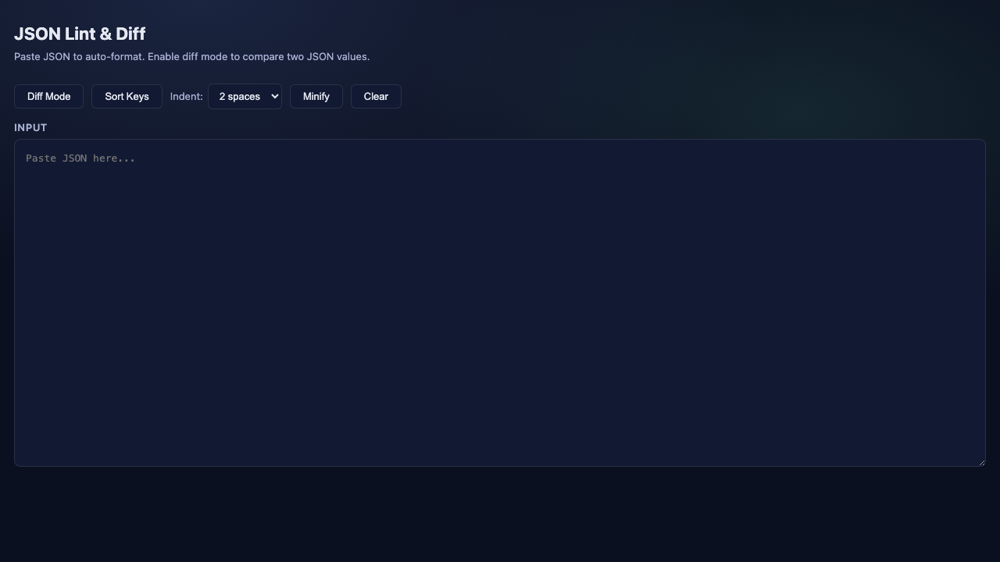
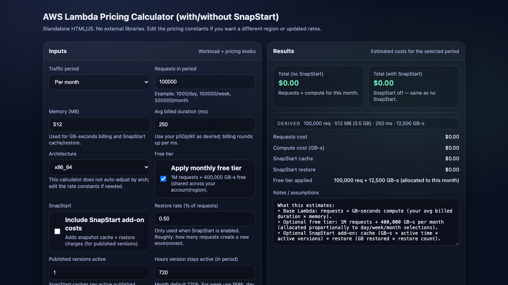
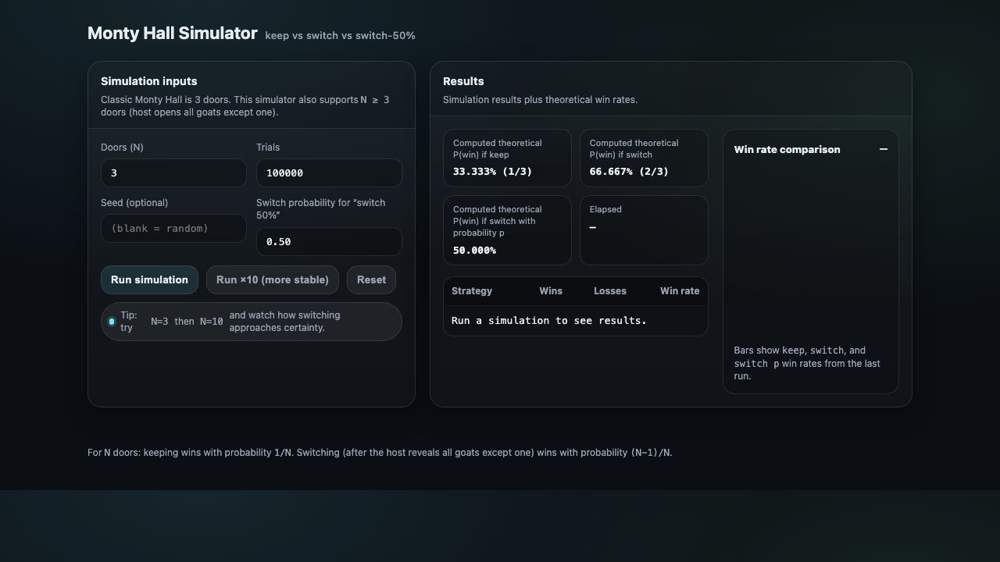
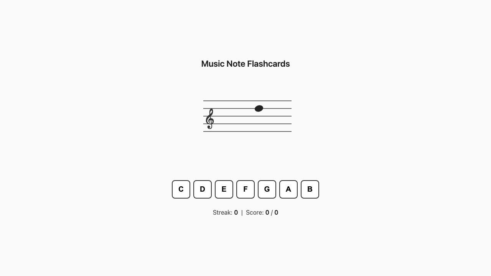

# App Directory

> Auto-generated by `npm run directory`. 4 apps.

## JSON Lint & Diff

[`apps/json-lint-diff/`](apps/json-lint-diff/)

Paste JSON to auto-format and validate. Optionally paste a second JSON to see a structural diff.

---

## AWS Lambda + SnapStart Pricing Calculator

[`apps/lambda-pricing-calculator/`](apps/lambda-pricing-calculator/)

Estimate AWS Lambda costs with and without SnapStart. Configure requests, memory, duration, free tier, and SnapStart cache/restore pricing.

---

## Monty Hall Simulator

[`apps/monty-hall-simulator/`](apps/monty-hall-simulator/)

Simulate the Monty Hall problem with configurable doors, trials, and strategies. Compare keep, switch, and mixed strategies against theoretical win rates.

---

## Music Note Flashcards

[`apps/music-note-flashcards/`](apps/music-note-flashcards/)

Practice identifying notes on the treble clef staff. A random note appears and you guess its name — tracks streak and score.

---
